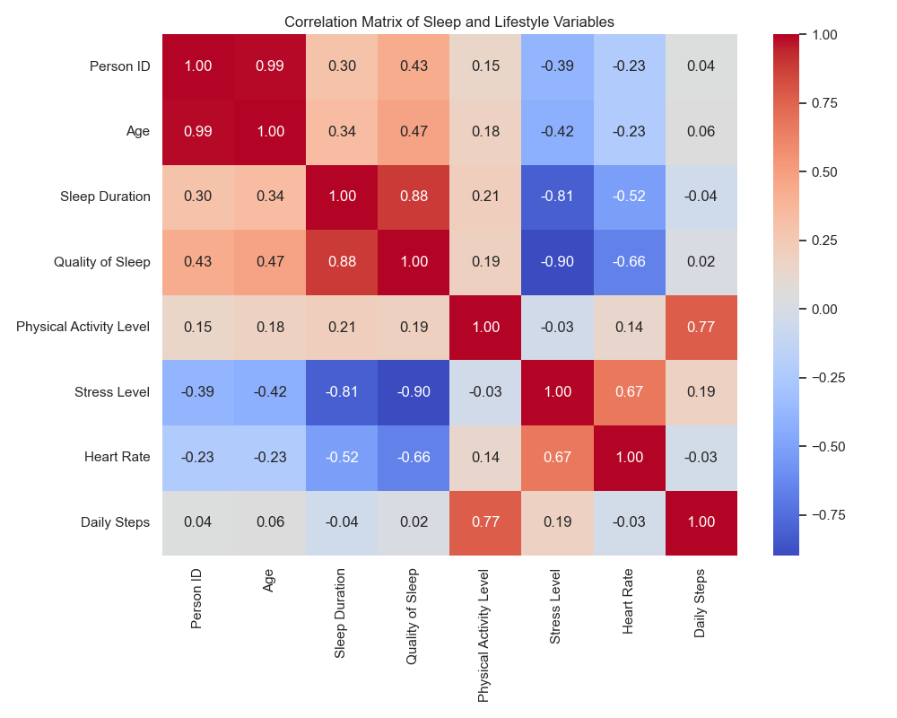
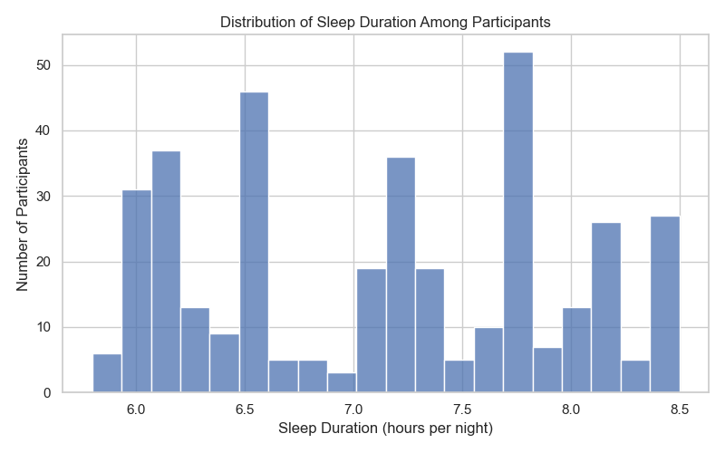
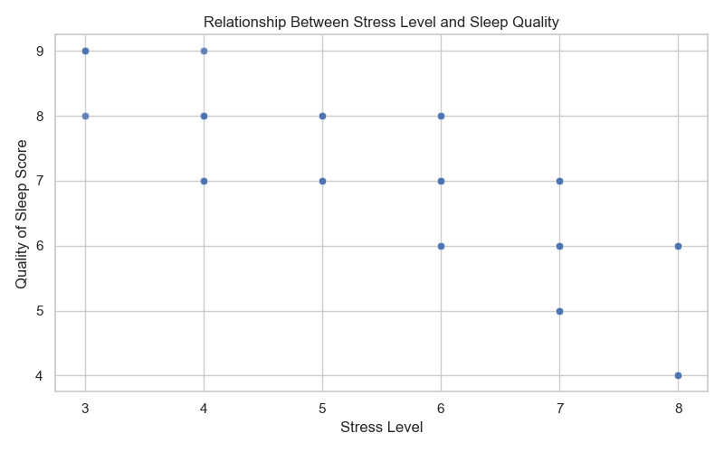
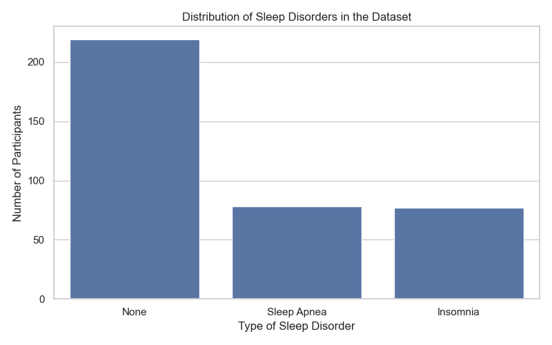
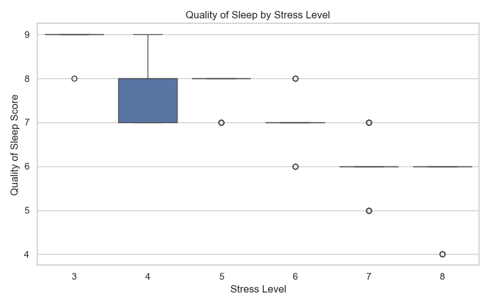
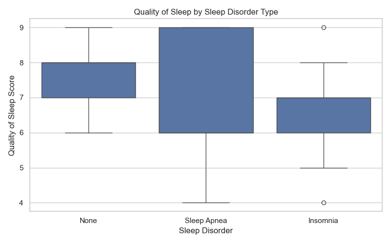
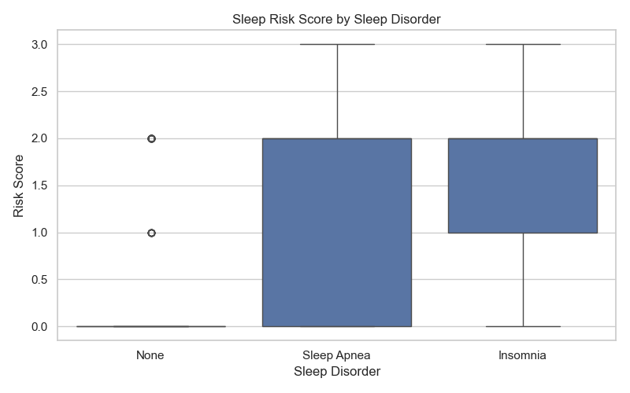

# Neurobehavioral Determinants of Sleep Quality and Sleep Disorders  
### A Lifestyle and Sleep Health Exploratory Neuro-Data Analysis

[](LICENSE)


---

## Project at a glance

**Goal**  
Investigate how lifestyle behaviours and physiological indicators influence sleep quality and the presence of sleep disorders.

**Dataset**  
Sleep Health and Lifestyle Dataset containing **374 participants**.

**Methods**  
Exploratory Data Analysis, visualization, correlation analysis, and feature interpretation.

**Key question**  
Which behavioural and physiological variables appear most strongly associated with sleep quality and sleep disorders?

---

# Abstract

<p align="justify">
Sleep plays a critical role in cognitive performance, emotional regulation, metabolic balance, and overall health. However, modern lifestyles expose individuals to behavioral and physiological stressors that may disrupt sleep patterns. This project analyzes the Sleep Health and Lifestyle Dataset to explore relationships between lifestyle behaviors, physiological indicators, and sleep outcomes.
</p>

<p align="justify">
Exploratory analyses were conducted to examine how stress levels, physical activity, daily steps, heart rate, and other physiological indicators relate to sleep duration, sleep quality, and sleep disorders. Results indicate that higher stress levels are associated with poorer sleep quality and that individuals reporting sleep disorders exhibit reduced sleep satisfaction.
</p>

<p align="justify">
These findings highlight the importance of behavioral and physiological determinants of sleep health and demonstrate how data-driven analysis can uncover patterns linking lifestyle variables to sleep outcomes.
</p>

---

# Key Findings



The correlation matrix highlights relationships between behavioral and physiological variables.

Main insights include:

- Stress levels show a clear negative association with sleep quality.
- Participants with sleep disorders report lower sleep quality scores.
- Lifestyle behaviors such as physical activity and daily routines appear related to sleep patterns.
- Physiological indicators such as heart rate may reflect stress-related effects on sleep.
- A simple behavioral **Sleep Risk Score** is higher among participants with reported sleep disorders.

---

# Table of Contents

1. Introduction  
2. Why This Project Matters  
3. Scientific Background  
4. Research Question  
5. Dataset and Variables  
6. Methods  
7. Results  
8. Data Science Results  
9. Neuroscientific Interpretation  
10. Discussion  
11. Limitations  
12. Future Directions  
13. Glossary  
14. References  

---

# How to run the project

```
git clone https://github.com/malou-tp-data/sleep-neuroscience-project.git
cd sleep-neuroscience-project
pip install pandas matplotlib seaborn
python analysis.py
```

---

# 1. Introduction

<p align="justify">
Sleep is a fundamental biological process necessary for maintaining cognitive functioning, emotional stability, and physiological recovery. Insufficient or poor-quality sleep has been linked to numerous health consequences including impaired cognitive performance, increased stress, metabolic dysregulation, and cardiovascular risk.
</p>

<p align="justify">
Modern lifestyles often expose individuals to behavioral factors that may disrupt healthy sleep patterns. Chronic stress, irregular routines, limited physical activity, and physiological health indicators can influence sleep duration and perceived sleep quality.
</p>

<p align="justify">
This project investigates the relationships between lifestyle behaviors and sleep outcomes using exploratory data analysis techniques applied to a structured behavioral dataset.
</p>

---

# 2. Why This Project Matters

<p align="justify">
Sleep disorders represent a major public health concern affecting millions of individuals worldwide. Understanding behavioral predictors of sleep quality is essential for identifying modifiable lifestyle factors that may improve sleep health.
</p>

<p align="justify">
Large behavioral datasets provide valuable insights into sleep patterns outside laboratory environments. Data-driven analysis allows researchers to identify relationships between lifestyle behaviors and sleep outcomes at scale.
</p>

---

# 3. Scientific Background

<p align="justify">
Sleep regulation is governed by circadian rhythms and homeostatic sleep pressure. Stress responses activate the hypothalamic-pituitary-adrenal axis, increasing cortisol levels which can disrupt sleep onset and sleep continuity.
</p>

<p align="justify">
Lifestyle behaviors such as exercise and daily routines influence circadian stability and sleep efficiency. Understanding how these behavioral variables interact with sleep outcomes provides valuable insights for sleep research and health analytics.
</p>

---

# 4. Research Question

To what extent do lifestyle behaviors and physiological variables influence sleep quality and sleep disorders?

---

# 5. Dataset and Variables

Dataset: **Sleep Health and Lifestyle Dataset**

| Category | Variables |
|----------|-----------|
| Demographics | Age, Gender |
| Sleep Metrics | Sleep Duration, Quality of Sleep |
| Lifestyle | Stress Level, Physical Activity Level, Daily Steps |
| Physiology | Heart Rate, Blood Pressure |
| Disorders | Insomnia, Sleep Apnea |

---

# 6. Methods

The analysis pipeline included:

1. Data inspection and cleaning  
2. Descriptive statistical analysis  
3. Exploratory data visualization  
4. Correlation analysis between lifestyle and sleep variables  

Python libraries used:

- pandas  
- matplotlib  
- seaborn  

---

# 7. Results

## Sleep Duration Distribution



**Result summary**

- Most participants report between **6 and 8 hours of sleep**.
- Some variability exists, indicating heterogeneous sleep behaviors across individuals.
- Extremely short and long sleep durations are less frequent.

---

## Stress vs Sleep Quality



**Result summary**

- Higher stress levels are associated with **lower sleep quality scores**.
- The trend suggests stress may negatively affect sleep satisfaction.

---

## Sleep Disorder Distribution



**Result summary**

- The dataset includes participants reporting **insomnia, sleep apnea, and no disorder**.
- Individuals without reported sleep disorders represent the majority of the dataset.

---

## Sleep Quality by Stress Level



**Result summary**

- Participants with higher stress levels tend to report **lower average sleep quality**.
- The distribution suggests stress may play an important role in sleep outcomes.

---

## Sleep Quality by Sleep Disorder



**Result summary**

- Participants with insomnia or sleep apnea show **lower sleep quality scores** compared to those without disorders.

---

## Correlation Matrix


**Result summary**

- Stress and sleep quality display a negative relationship.
- Sleep duration shows moderate association with sleep quality.

---

# 8. Data Science Results

To extend the exploratory analysis without relying on a machine learning library, a simple **behavioral sleep risk score** was constructed.

The score combines three indicators associated with poorer sleep outcomes:

- **High Stress**: Stress Level greater than or equal to 7  
- **Low Sleep Quality**: Quality of Sleep less than or equal to 5  
- **Short Sleep**: Sleep Duration below 7 hours  

Each participant receives one point for each risk indicator present, producing a total **Sleep Risk Score** ranging from 0 to 3.

This approach does not aim to replace a predictive model. Instead, it provides a transparent and interpretable way to summarize how multiple behavioral risk factors cluster across participants.

## Sleep Risk Score by Sleep Disorder



**Result summary**

- Participants with reported sleep disorders tend to have **higher average risk scores**.
- Individuals without sleep disorders generally show **lower cumulative behavioral risk**.
- The score suggests that stress, poor perceived sleep quality, and reduced sleep duration tend to cluster in participants with sleep disturbances.

This risk profiling approach highlights how simple behavioral indicators can already provide useful insight into sleep vulnerability.

---

# 9. Neuroscientific Interpretation

Key brain regions involved in sleep regulation:

| Brain Region | Function |
|--------------|-----------|
| Hypothalamus | Circadian rhythm regulation |
| Brainstem | Sleep stage transitions |
| Prefrontal Cortex | Cognitive and emotional regulation |
| Amygdala | Emotional processing |

Activation of the **HPA axis** during stress increases cortisol levels and may disrupt sleep patterns.

---

# 10. Discussion

<p align="justify">
The analysis reveals several relationships between lifestyle behaviors and sleep outcomes. One of the most consistent patterns observed is the negative relationship between stress levels and sleep quality. Individuals reporting higher stress scores tend to report poorer sleep quality, suggesting that psychological stress may significantly influence perceived sleep satisfaction.
</p>

<p align="justify">
Participants reporting sleep disorders such as insomnia and sleep apnea also demonstrate significantly lower sleep quality scores. This observation is consistent with clinical sleep research, which shows that sleep disorders often lead to fragmented sleep architecture and reduced restorative sleep.
</p>

<p align="justify">
Sleep duration shows moderate associations with sleep quality. While many individuals report sleep durations between six and eight hours, variations in sleep duration may reflect differences in lifestyle behaviors, stress exposure, or physiological factors.
</p>

<p align="justify">
Lifestyle behaviors such as physical activity may also contribute to improved sleep outcomes. Regular physical activity has been associated with improved sleep efficiency and reduced sleep latency in numerous studies.
</p>

<p align="justify">
Although this dataset does not allow causal inference, the observed patterns highlight potential behavioral predictors of sleep disturbances. These findings emphasize the importance of considering lifestyle factors when investigating sleep health.
</p>

<p align="justify">
To move beyond purely descriptive analysis, a simple behavioral risk profiling approach was introduced. By combining high stress, low sleep quality, and short sleep duration into a cumulative score, it becomes possible to identify participants with a higher concentration of sleep-related vulnerability factors. Participants reporting sleep disorders tend to show higher average scores, suggesting that even simple rule-based profiling may provide useful insight into sleep risk patterns.
</p>
---

# 11. Limitations

- Self-reported dataset may include reporting bias  
- Cross-sectional dataset prevents causal inference  
- Limited sample size compared to clinical sleep studies  

---

# 12. Future Directions

- Apply machine learning models to predict sleep disorders  
- Integrate wearable sleep-tracking datasets  
- Conduct longitudinal sleep analyses  
- Investigate circadian rhythm variables  
- refine the behavioral sleep risk score with additional physiological indicators

---

# 13. Glossary

| Term | Definition |
|------|-------------|
| Sleep Quality | Subjective evaluation of sleep satisfaction |
| Sleep Duration | Number of hours slept per night |
| Circadian Rhythm | Biological sleep-wake cycle |

---

# 14. References

Walker, M. (2017). *Why We Sleep*.  
Carskadon & Dement (2011). *Principles and Practice of Sleep Medicine*.  
Grandner (2017). Sleep and Health Research.